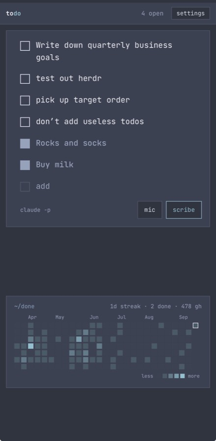

# LS todo

One list. One someday. One text file. Bring your agent.



A to-do list that behaves like a note. Every line is editable in place and saves when you stop typing. Boxes are the only controls. The list is one plain-text file, so the phone app, the command line, and any AI agent you already use can all read and write the same thing.

The app is LS todo. The command stays `todo`.

The agent's job is called the scribe. You log lines in your own words. When you ask, the scribe rewrites them into outcomes, breaks a big line into the smaller outcomes that get it done, and asks you instead of guessing when a line could go two ways. It never adds a name, number, or date you did not write.

## The opinion

- **Outcomes, not tasks.** `call alex about the deck` becomes `ALEX CALLED ABOUT THE DECK.` A headline states a checkable state of the world.
- **Big lines get broken down.** `launch the course by oct 1` becomes `COURSE OUTLINE WRITTEN.`, `COURSE LESSONS RECORDED.`, `COURSE LESSONS EDITED AND UPLOADED.`, `COURSE LAUNCHED BY OCT 1.` In order, first one doable today, last one finishes the big line.
- **One place, one someday.** No projects, no tags, no priorities, no dates. Write `someday`, `maybe`, `sometime`, or `later` in a line and it moves down. Write `now` or `today` and it comes back.
- **Type first, clean later.** Return logs the line as written. Scribe is a button for whenever you want the logged lines cleaned. Undo is the safety net.
- **The file is the truth.** Export is the file. Import is the file. Agents edit the file.

## Install with your agent

Paste this into the agent you already use, on the computer that will hold the list. Claude Code, Codex, Hermes, and Grok all work. It takes about a minute.

```
Install LS todo for me from https://github.com/heymitch/ls-todo

1. Check `node --version` is 20 or newer. If not, install Node first and tell me.
2. Clone the repo to ~/ls-todo, or `git pull` if it is already there.
3. Run: node ~/ls-todo/cli/todo install --via <your own name: claude, codex, hermes, or grok>
   It puts the `todo` command on my PATH, registers the server to start at login,
   publishes it on my Tailscale network if Tailscale is installed, and prints the URLs.
4. Show me the tailnet URL it printed and the phone steps. If it said Tailscale is
   missing, tell me to install Tailscale on this computer and on my phone, then rerun step 3.
5. Run `todo` and show me the list to prove it works.
```

That is the whole install. If you would rather do it by hand: Node 20 or newer, `git clone https://github.com/heymitch/ls-todo`, `node ls-todo/cli/todo install`. Or skip the service entirely with `node cli/todo serve` and open http://127.0.0.1:8791.

Then open settings in the app and pick the agent that is installed on this machine: `claude` for Claude Code, `codex`, `hermes`, or `grok`. Press **test** to see it answer. If none of those is installed, pick `paste`: the scribe button copies its prompt, you paste it into any AI, and you paste the reply back into a line.

## On your phone

The server has no login, so it should never face the internet. The clean way to reach it from a phone is a private network. [Tailscale](https://tailscale.com) is free for personal use and gives every device you own a private address and a trusted HTTPS name. The installer publishes the server there for you; by hand it is one command:

```
tailscale serve --bg --https=8790 http://127.0.0.1:8791
```

With Tailscale on the phone, open `https://<machine>.<tailnet>.ts.net:8790/` and use Add to Home Screen. HTTPS matters here: it is what lets the page install as an app.

## Does the computer have to stay on?

The list lives on the computer that runs the server, so the phone can sync and scribe only while that computer is awake. The installer registers the server as a login service: it comes back after a reboot and restarts if it dies. Close the laptop and the server sleeps with it.

When the phone cannot reach the server it keeps the last copy it saw, marked **offline** with the time of the last sync. You can still check boxes and add lines. A **start** button next to scribe tries the server again; when it answers, lines you added offline go up and nothing is deleted. Scribe falls back to the paste door while offline.

If you want it always on, run the server on a machine that stays up, a Mac mini or a small VPS on the same tailnet, and point the phone there. `todo uninstall` removes the service and the tailnet route and leaves your file alone.

## Bring your agent

There are three ways an agent meets the list. They stack.

**1. The scribe runs on the server machine.** Pick a preset in settings. The server pipes the scribe prompt into that command on stdin and reads the reply on stdout. `claude -p`, `codex exec -`, `hermes -z`, and `grok -p` all do that. Any command that does the same works, and you set it on the machine with `todo config via '<command>'`.

**2. Any AI, anywhere, by hand.** The paste door. No install, no network. The prompt travels on your clipboard.

**3. An agent connects itself.** Settings has a **copy setup** button. It copies a short brief that tells an agent where the server is, what the file looks like, the four HTTP calls, and the rules, then asks it to prove the connection by reading the list and appending one line. Paste that into Claude Code, Codex, Hermes, or any agent that can make HTTP calls. `todo connect` prints the same brief from the terminal.

If the agent runs on another machine, such as a cloud agent on a VPS, it has to be able to reach the server. That is what Tailscale is for: install it on the server machine and on the agent's machine, and the agent uses the same private HTTPS name your phone does. Do not open the server to the internet to let a cloud agent in.

An agent on the same machine does not need HTTP at all. It can edit the file or run the `todo` CLI.

## How it works

**A note that knows what a checkbox is.** Tap a line, type, stop. It saves half a second after you stop typing and again when you leave the line. Return logs a new line. Backspace on an empty line deletes it. Escape leaves a line. On the desktop, `N` focuses the add line, `T` cycles themes, `,` opens settings.

**The scribe.** One prompt in `scribe.js`. It takes your raw lines and asks for items in the file format, with rules that forbid adding names, numbers, dates, or sources. What it does with the lines is a setting with three choices: **break big lines down** into two to five smaller outcomes, **one line, one item**, or **merge lines about the same thing**. On top of that you can add one instruction of your own, such as "headlines under six words", and the scribe follows it unless it would mean inventing something. A deterministic guard then flags any number or content word in a scribed item that was not in your lines. Flags underline. They never block. A child of a broken-down line is expected to add ordinary words for its step, so only new numbers flag there.

**Done lines.** Checking a box stamps the line with the time. How long it stays in the list is a setting: gone at once, an hour, today, a week, or forever. It always stays in the file and on the heat map.

**When the scribe is not sure, it asks.** A line with two plausible outcomes comes back as a question with complete items as options, shown as a menu over the list. Number keys, `j` and `k`, Return, or a tap pick one. Escape keeps your words. At most two questions per scribe, never about wording.

**The heat map.** One square per day for the last year, pinned to the bottom of the screen: checked boxes plus your real GitHub contributions, with commits weighing double. Counts come through the GitHub CLI's login on the server machine, cached for an hour. Set the login in settings. Without it, the map shows checked boxes only.

## The format

```
## Todo

* [ ] **ALEX CALLED ABOUT THE DECK.** Ask about the budget first. Source: notes/deck.md
* [ ] call sam about the video
* [x] **QUARTERLY GOALS WRITTEN DOWN.** Done: 2026-09-13

## Someday

* [ ] **RUST LEARNED.**
```

A bold line is scribed. A plain line is raw. `Source:` is an optional pointer. `Done:` is stamped when you check the box, as a date or a date and time such as `2026-09-13T14:05`. Files with other headings fold into Todo.

## Settings

A config file, rendered. Eight rows, all saved on the server in `.todo.json` next to your file.

- **agent.** A preset or the paste door. **test** asks the agent for one word.
- **scribe.** Break big lines down, one line one item, or merge lines about the same thing, plus your own instruction.
- **done.** How long a checked line stays in the list: gone, an hour, today, a week, forever.
- **github.** The login for the heat map.
- **server.** The file and host. A second line takes another server's URL, for a copy of the page hosted elsewhere.
- **connect.** The copy setup button described above.
- **theme.** Eight swatches. Themes are data; structure is law. See `DESIGN.md`.
- **file.** Export, copy, import, the scribe prompt, delete all, and the raw text.

## CLI

```
todo                                  open items, numbered
todo list --all
todo add "call alex by friday"        raw line, as written
todo add "learn rust" --someday
todo done 3
todo scribe [--via codex] [--dry]     clean the raw lines in the file
todo capture dump.txt                 clean outside text and add the result
todo prompt                           print the scribe prompt for your raw lines
todo connect [--server URL]           print the setup brief for an agent
todo import reply.md                  merge items already in the format
todo config via hermes                agent preset, or a command in quotes
todo config scribe one                unbundle | one | merge
todo config extra "headlines under six words"
todo config keep week                 gone | 1h | today | week | forever
todo config github <login>
todo config url https://...           the server's private URL, used by todo connect
todo install [--via claude] [--github <login>] [--no-tailscale]
todo uninstall
todo serve [--port 8791] [--host 127.0.0.1]
todo raw | todo path
```

`TODO_FILE` sets the file, default `~/todo.md`. `TODO_CONFIG` sets the config.

## Read this before you host it

- The server has no login. Anyone who can reach it can read and write your file and run your agent with your credentials. Keep it on a private network.
- The app can switch between preset agents and the paste door over the network. It can never send a shell command. A custom command is set only on the machine that runs the server. Keep it that way.
- The server answers with permissive CORS so a copy of the page hosted elsewhere can talk to it. On a private network that is fine. On the open internet it is not.

## Widget

`widget/todo-widget.js` is a home-screen widget for Scriptable on iOS. It reads `/api/summary` from your server and shows the open count, the next lines, and the streak. Set `SERVER` at the top of the script. The phone needs the same private network as the app.

## Files

- `index.html` the page and the design contract: twelve theme tokens, one structure.
- `app.js` the human door.
- `format.js` parse, serialize, merge, absorb, decomposition, inference, guard.
- `scribe.js` the scribe prompt, the connect brief, the agent presets, reply cleaning.
- `cli/todo` the CLI and the server. No dependencies.
- `sw.js`, `manifest.json`, `icon.svg` install and offline.
- `test/` deterministic seams: `node --test`.
- `install/` a launchd plist and a systemd unit.

## Status

Single user. Tested on iOS Safari as a home-screen app and on desktop Chromium. One write at a time with a change check; last write wins. No sync when the page runs without a server.

## License

MIT. Copyright Mitch Harris.
